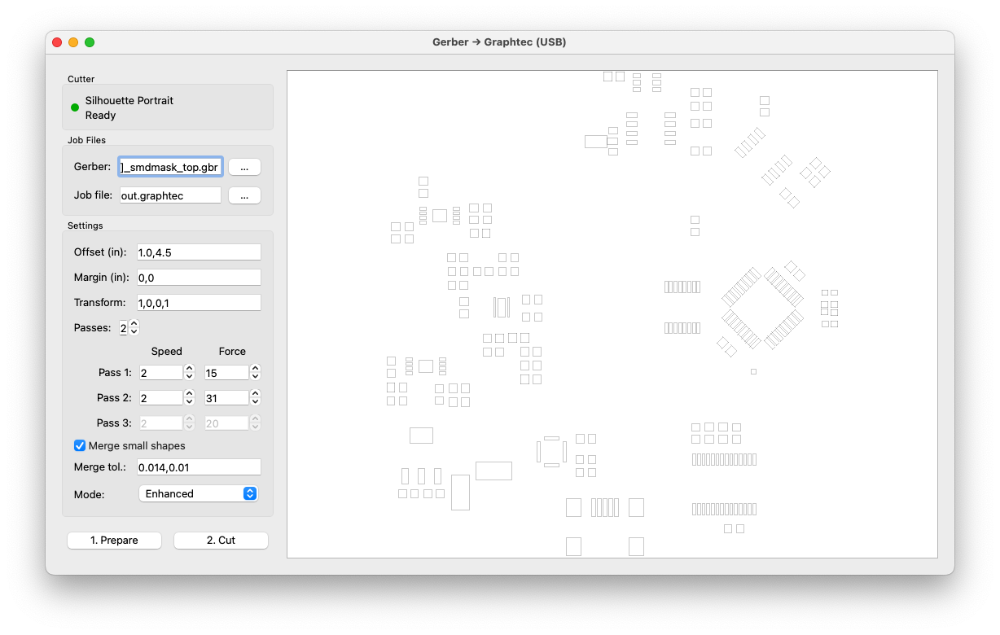

# Gerber‑to‑Graphtec (USB) – Cut Solder *Mask* & Paste Stencils on Silhouette Cutters

**Fork + modern PyQt5 GUI rewrite** of the classic *gerber2graphtec* toolchain for producing **accurate SMT solder *****mask***** (and paste) stencils** on low‑cost Graphtec‑engine craft cutters (Silhouette Cameo / Portrait family).

This fork replaces the original Gerber→(gerbv→pstoedit→pic) conversion chain and legacy Tk/Tkinter GUI with a **direct, cross‑platform Python + PyQt5 workflow**:

- Parse Gerber natively using [**pcb‑tools**](https://github.com/curtacircuitos/pcb-tools) — no gerbv/pstoedit/Ghostscript toolchain needed.
- Convert Gerber primitives (lines, arcs, flashes, polygons) into optimized cutter strokes.
- Generate Graphtec/Silhouette job commands via the bundled `graphtec` backend.
- Stream the job **directly over USB** using [**pyusb**](https://github.com/pyusb/pyusb) — no CUPS, no `/dev/usb/lp0` piping.
- Poll cutter state (Ready / Moving / No Media / Paused) using low‑level control bytes informed by [**py\_silhouette**](https://github.com/mossblaser/py_silhouette).

⚙️ **Primary purpose:** Quickly turn your PCB **solder *****mask***** (or solder‑paste)** Gerber layer into a **mylar / film stencil** suitable for hand assembly, rework, reflow prototyping, and masking experiments. Field use shows good results in thin transparency film (\~3–5 mil) down to \~0.5 mm pitch with tuning.

---

## Screenshot




---

## Why this fork?

The original `gerber2graphtec` command‑line tool and early GUI (Tk/Tkinter) produced excellent results but depended on an aging external toolchain (gerbv, pstoedit, Ghostscript, pic) and sometimes fragile USB printer paths. Installing all of that on modern macOS systems — and especially mixing in Windows — became painful.

This fork modernizes the pipeline while preserving the original project’s proven cutting strategies (short segment output, anti‑backlash planning, multi‑pass profiles, etc.). It adds a clean **PyQt5 GUI**, **direct USB streaming**, **live device status**, and **settings persistence**.

---

## Key Features

### Modern Gerber Ingest

- RS‑274X parsing via **pcb‑tools**.
- Supports common primitives: lines, rectangles, circles, obrounds, polygons, arcs (normalized + segmented for cutting).
- Optional geometry cleanup: **merge small shapes** below user thresholds (`min_size`, `min_dist`).

### USB‑Native Cutter Control

- Auto‑detects connected Silhouette devices by VID/PID (Portrait / Cameo families; see table below).
- Direct **bulk USB streaming** (chunked packets; tunable `CHUNK` size).
- Device **status polling** (Ready, Moving, No Media, Paused) using commands informed by *py\_silhouette*.
- Color state indicator: red = none, yellow = not ready, green = ready, blue = cutting.

### Interactive PyQt5 GUI

- **Prepare → Cut** 2‑step workflow.
- Live zoomable preview canvas (wheel zoom; anti‑aliased drawing).
- Centered "Preview" placeholder when no data loaded.
- **Multi‑Pass control**: select 1–3 passes; per‑pass Speed & Force spin boxes stay in sync.
- **Enhanced vs Standard** cutting modes: optimized line sequencing vs polygon outline cutting.
- Offset & Margin (inches) to position stencil on sheet.
- Transform matrix (advanced affine tweak/calibration).
- Merge tolerance (inches) for collapsing tiny apertures.
- Cancelable cut with safe USB release.
- Automatic settings persistence via **QSettings** (saved when you click *Prepare*).

### Reliability / UX

- Non‑blocking USB streaming thread keeps GUI responsive.
- Post‑job USB cleanup prevents permission lockups between runs.
- Auto device‑status polling (idle) + status refresh during jobs.
- Pre‑flight readiness check warns if no media is loaded (helps avoid silent no‑cut failures).

---

## Quick Start

> **Tested hardware:** Silhouette **Portrait (1st gen)** on macOS. Other cutters listed below are **auto‑detected but untested** — community feedback welcome!
>
> **OS support:** Developed on macOS. Windows & Linux builds are **not yet fully tested**; please report results.

### 1. Install (recommended: virtualenv)

```bash
python -m venv .venv
source .venv/bin/activate  # Windows: .venv\Scripts\activate
pip install --upgrade pip
pip install numpy scipy pcb-tools pyusb PyQt5
```

The repository includes helper modules (`graphtec.py`, `optimize.py`, `mergepads.py`, `gerber_parser.py`) which are imported locally; no package install needed if you run from a clone of this repo.

### 2. Run the GUI

```bash
python g2g_gui.py
```

### 3. Prepare a Cut Job

1. Select your **Gerber** (*.gbr*) solder *mask* (or paste) layer.
2. Choose an **output job file** (*.graphtec*).
3. Adjust **Offset** & **Margin** to position the stencil on your film.
4. Pick **Passes** (1–3) and set per‑pass **Speed** (1–10) & **Force** (1–33).
5. (Optional) Enable **Merge small shapes**; set **Merge tol.** (inches) as `min_size,min_dist`.
6. Choose **Mode**: *Enhanced* (optimized lines) or *Standard* (closed polygons).
7. Click **1. Prepare**. A preview renders; your settings are saved.

### 4. Cut

1. Load film / mylar in the cutter.
2. Wait for the status indicator to turn **green / Ready**.
3. Click **2. Cut**.
4. Watch progress (cancel if needed).

---

## Parameter Reference

| Parameter  | Units      | GUI Field   | Description                                                                                                                                                      |
| ---------- | ---------- | ----------- | ---------------------------------------------------------------------------------------------------------------------------------------------------------------- |
| Offset     | inches     | Offset (in) | X,Y shift applied before output. Use to locate stencil on loaded film.                                                                                           |
| Margin     | inches     | Margin (in) | Extra border added around design extents; cutter can frame the area.                                                                                             |
| Transform  | raw coeffs | Transform   | Affine matrix `[a,b,c,d]` (scales/shears). Advanced calibration / compensation.                                                                                  |
| Passes     | count      | Passes      | 1–3 multi‑pass cuts. Additional passes can improve cut‑through in thicker film.                                                                                  |
| Speed      | steps      | Speed cols  | 1 = slowest, 10 = fastest. Lower speed improves detail in thin film.                                                                                             |
| Force      | steps      | Force cols  | 1 = light, 33 = heavy. Dial in for your film & blade.                                                                                                            |
| Merge tol. | inches     | Merge tol.  | Two comma values: `min_size,min_dist`. Shapes smaller than `min_size` or closer than `min_dist` may be merged/simplified. Uses `mergepads.fix_small_geometry()`. |
| Mode       | select     | Mode        | **Enhanced:** optimized line sequencing (fast); **Standard:** closed polygons (fidelity to outline).                                                             |

---

## Supported Devices (auto‑detected by VID/PID)

> VID/PID values sourced from the **py\_silhouette** project. Only **Silhouette Portrait (1st gen)** has been tested with this GUI so far; others are expected to work but need community validation.

| Model                   | VID    | PID    | Tested? |
| ----------------------- | ------ | ------ | ------- |
| Silhouette Portrait     | 0x0B4D | 0x1123 | ✅ macOS, Kubuntu |
| Silhouette Portrait 2   | 0x0B4D | 0x1132 | ❓       |
| Silhouette Portrait 3   | 0x0B4D | 0x113A | ❓       |
| Silhouette Cameo        | 0x0B4D | 0x1121 | ❓       |
| Silhouette Cameo 2      | 0x0B4D | 0x112B | ❓       |
| Silhouette Cameo 3      | 0x0B4D | 0x112F | ❓       |
| Silhouette Cameo 4      | 0x0B4D | 0x1137 | ❓       |
| Silhouette Cameo 4 Plus | 0x0B4D | 0x1138 | ❓       |
| Silhouette Cameo 4 Pro  | 0x0B4D | 0x1139 | ❓       |

Detection is first‑match: if more than one supported cutter is connected, the first enumerated USB device will be used.

---

## Materials & Cut Tips

- Use **mylar / polyester film \~3–5 mil** thick (laser transparency stock works well).
- Many users **shrink PCB pad apertures \~2 mils** in CAM before export; hobby blades can flare geometry slightly.
- Start conservative: Speed \~2, Force \~5 first pass; add deeper force on 2nd/3rd passes.
- Inspect under backlight; weeded apertures should be crisp.

(These guidelines build on real‑world results from the original project; links below.)

---

## Dependencies (Python)

Extracted from the source modules in this repository:

| Package       | Used For                                |
| ------------- | --------------------------------------- |
| **pcb-tools** | Native Gerber parsing (rs274x)          |
| **pyusb**     | Direct USB access to Silhouette cutters |
| **PyQt5**     | Cross‑platform GUI framework            |

Install via pip:

```bash
pip install pcb-tools pyusb PyQt5
```

(Other imports in the source tree are Python standard library or local modules bundled with the repo.)

---

## Development Notes

- Developed on **macOS** & tested on **macOS** and **Kubuntu** with a **Silhouette Portrait (gen 1)**.
- Windows & other Linux flavors are **currently untested**; PyUSB + appropriate permissions *should* enable support — please report success/failures.
- When running on **Linux** you may need a **udev rule** to grant non‑root USB access (VID 0x0B4D, matching your PID).
- If the cutter seems to accept data instantly but does not move, confirm material is loaded; the GUI polls state but cannot always detect failed loads on all models.
- Adjust `CHUNK` in `g2g_gui.py` to tune progress granularity vs overhead (smaller = finer progress updates).

---

## Original Resources & Further Reading

These pages (from the **original project README**) document the techniques, calibration ideas, materials, and background that inspired this tool and its fork.

- [http://pmonta.com/blog/2012/12/25/smt-stencil-cutting/](http://pmonta.com/blog/2012/12/25/smt-stencil-cutting/)
- [http://dangerousprototypes.com/forum/viewtopic.php?f=68&t=5341](http://dangerousprototypes.com/forum/viewtopic.php?f=68\&t=5341)
- [http://hackeda.com/blog/start-printing-pcb-stencils-for-about-200/](http://hackeda.com/blog/start-printing-pcb-stencils-for-about-200/)
- [http://hackaday.com/2012/12/27/diy-smd-stencils-made-with-a-craft-cutter/](http://hackaday.com/2012/12/27/diy-smd-stencils-made-with-a-craft-cutter/)

### GUI origin (historical)

An early optional GUI was contributed by **jesuscf** (Tk/Tkinter) in the Dangerous Prototypes thread. This fork is a **complete PyQt5 rewrite** with direct USB streaming.

### Protocol Documentation Credits (Original Project)

Thanks to the authors of **robocut** and **graphtecprint** for Graphtec protocol information:

- [http://gitorious.org/robocut](http://gitorious.org/robocut)
- [http://vidar.botfu.org/graphtecprint](http://vidar.botfu.org/graphtecprint)
- [https://github.com/jnweiger/graphtecprint](https://github.com/jnweiger/graphtecprint)

Additional inspiration: **Cathy Sexton** – [http://www.idleloop.com/robotics/cutter/index.php](http://www.idleloop.com/robotics/cutter/index.php)

---

## Contributing

**Community testing needed!** If you have any of the following, please help:

- A Silhouette cutter *other than* Portrait (gen 1).
- Windows or Linux environment.
- Different film / stencil materials.

Please try a small test cut and open a GitHub issue with:

- Cutter model & firmware (if known).
- OS + Python version.
- Whether device auto‑detect worked.
- Whether status reporting matched the machine’s panel.
- Cut parameters (passes, speed/force) and material thickness.
- Photos of the resulting stencil (optional but helpful!).

Pull requests welcome for:

- Verified device quirks / better VID+PID selection logic when multiple units connected.
- Windows USB claim helpers.
- Improved error messages when state polling fails.
- Optional CLI front‑end to reuse the new pipeline.

---

## License

This fork retains the **original project’s license** (see `LICENSE` in this repository). Modifications © their respective contributors.

If the upstream license file is missing in your fork, please copy it in full from the original repository before release.

---

## Acknowledgements

This fork stands on a lot of earlier work.

- The original *gerber2graphtec* command‑line utilities and community discussion that proved low‑cost craft cutters can produce usable SMT stencils.
- Contributors in the Dangerous Prototypes forums, including **jesuscf**, who produced an early GUI (Tk/Tkinter) that helped many users get started.
- The authors and maintainers of **robocut** and **graphtecprint**, whose protocol exploration informed Graphtec/Silhouette command formats.
- The maintainers of **pcb‑tools** (native Gerber parsing) and **py\_silhouette** (Silhouette USB protocol & device state research), both of which influenced this rewrite.
- Users who have shared real‑world cut settings, film choices, and calibration tips over the years.
- Guidance and iterative coding help provided through **ChatGPT (OpenAI)** during the PyQt5 rewrite and debugging.

Thank you to everyone who helps keep low‑cost stencil cutting practical and open.

